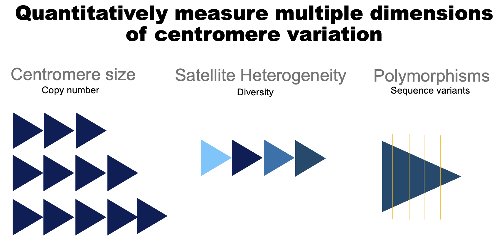

# Population and subsepcies diversity at mouse centromeres
[Arora et. al (2020)](https://doi.org/10.1186/s12864-021-07591-5)

Using publicly available whole genome sequencing data from diverse mouse strains and a customized k-mer based analysis, we comprehensively characterized multiple dimensions of mouse centromere variation.

This manuscript utilizes publicly available sequencing data from 3 different projects:
1) Sanger mouse genomes project: ftp://ftp-mouse.sanger.ac.uk/current_bams/
2) Wild mouse genomes project: http://wwwuser.gwdg.de/~evolbio/evolgen/wildmouse/
3) Mus caroli and Mus pahari genome assemblies: [Repeat associated mechanisms of genome evolution and function revealed by the Mus caroli and Mus pahari genomes](http://www.genome.org/cgi/doi/10.1101/gr.234096.117)

This repository contains the code and figures in the manuscript. This analysis was performed on a high performance computing cluster, and utilizes scripts written in bash, R, and Python.
## Scripts used in the analysis:
### Downloading and processing publicly available data

#### Sanger mouse genomes project
Note: The sanger mouse genomes project genomes sometimes had multiple sequencing libraries per strain. To ensure sequencing run was not confounding results, we processed and analyzed them separately, and once we confirmed there were no large differences, we went ahead and combined them.
sanger_bam_library_identifiers.sh: Extract sanger bams sequencing library information
sanger_split_libraries.sh: Split sanger bams by sequencing libraries
#### Wild mouse genomes project
wild_fastq.sh: Download wild mouse bam files into fastq format
#### Mus caroli and Mus pahari genome assemblies
caroli_pahari_process_fastq.sh: Download M. caroli and M. pahari fastq reads, map them to Mus musculus reference (mm10), remove optical duplicates, and convert bam files back to fastq format before proceeding with k-mer analysis.

### Processing fastq data to make k-mer tables
kmer_composition.py: Python script to read in a fastq file and output a k-mer table, with k-mer in first column and frequency of occurence in the fastq file in the second column

### Mapping k-mers to centromere consensus sequence
k31txt.to.fastq.py: Convert k-mer table into fastq format for mapping to centromere consensus
centromere_kmers.sh: Use bwa to map k-mers to centromere consensus (at the top of the script is the centromere consensus fasta file). Produces output mapped k-mer sam file.
process_mapped_sam.sh: process mapped k-mer sam file to make a dataframe

### GC correction for copy number estimation
GCcontent.py: Subsets k-mers for those that occur only once in the reference genome and calculates their GC%
GC_calculation.R: calculate GC% of each k-mer in the table
GCLoess.R: Loess regression on subsetted k-mers that only occur once in the mouse reference genome (mm10). Loess regression based on GC content.
GCcorrection.R: Correct each sample's raw k-mer counts by GC Loess regression predicted count

### using k-mers mapped to centromere consensus sequence to quantify polymorphisms
Consensus_script.R: Calculate nucleotide frequency at each position on minor and major consensus sequences using k-mer frequency and it's mapping position.

### Mapping reads to centromere consensus sequence to calculate the centromere diversity index
CentromereMapping.sh: Maps sequencing reads to centromere consensus sequence
CentromereMapped_LocationSplit.py: Split mapped reads by location on consensus sequence they map to, and output a csv file compiling reads that map to each position on consensus sequence

### Files used for plotting
final.set1.k31.correctedcount.txt: contains centromere 31-mers, readcount normalized count, and GC corrected counts.
Pi_Estimation_metadata: contains Centromere Diversity Index (CDI) values for samples
